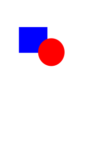
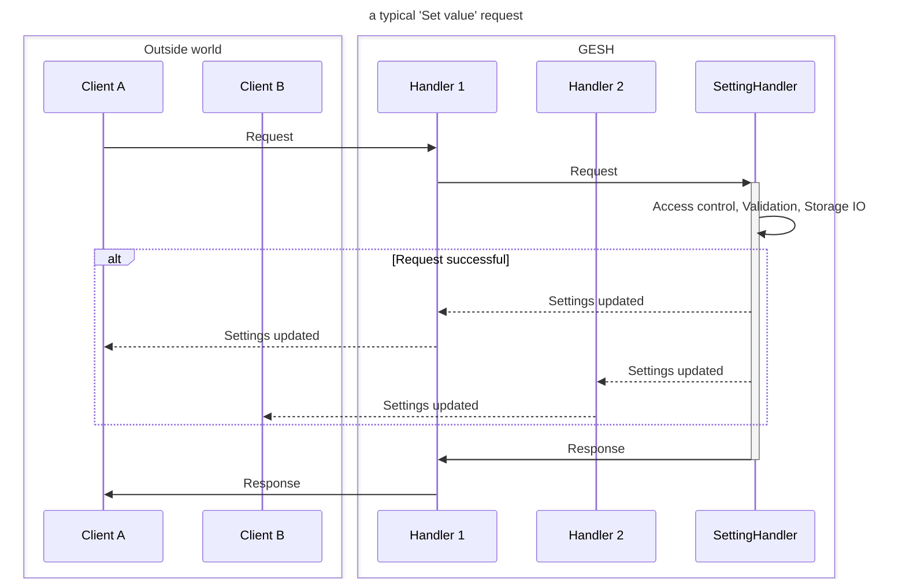

# GESH - Good Enough Settings Handler

Simple settings handler

# Core concepts
The headings below detail a few central concepts of GESH. The aim is to provide
an overview of how the application works and how it interacts with other
applications. Below is a very brief overview of how a Set request is handled
internally. In the example, GESH provides two interface handlers with one
client connected to each of them. In theory, there is no limit to the number
or type of interfaces nor the number of clients connected to each of them.

 

## The outside world
The central logic of GESH cares little for the outside world. This is instead
handled by specialized classes. The interaction between them is handled through
a SettingHandler object. Handlers that wish to monitor parameters and publish
updates to the outside world needs to implement the ISettingApiManager
interface and register themselves for updates.

For more info on handlers of the outside world, refer to their documentation:
- [D-Bus](src/dbus/dbus.md)

## The SettingHandler
All actors that contribute to the setting handling are described in greater
detail in [settings.md](src/setting/setting.md). The upcoming sections detail
an overview of the more common scenarios when interacting with GESH.

### Access control
Access control is managed on a per-handler basis. Each setting has a list of
handlers that is allowed to read and write the setting. If a handler attempts
access a setting in a way it is not permitted to, the entire request will fail.

### Validation
Settings managed by GESH are connected to rules. When the parameter is changed
(be it through initialization, importing or a `Set` request), the new value is
validated towards the rule. If the validation fails, the setting will not be
updated. For `Set` requests, this causes the entire request to fail. Other
types of operations typically ignore the parameter in question and moves on.

### Layers and storage
Each setting must be tied to a storage. The storage tells GESH how the setting
is persistently stored. In order to allow multiple levels of settings that
override each other, GESH employs a concept of _layers_. Each storage solution
may honor the layer when storing updates, making it possible to remove entire
layers worth of settings.

An example where this solution really shines is when an OEM wants to provide a
default configuration that could be used as a factory reset point. In this
case, the end user settings would be stored in a separate, higher priority
layer and could simply be removed in case of a factory reset. The table below
show how this coould work with three layers: User, OEM and Default.

|                 | Setting 1 | Setting 2 | Setting 3 |
| --------------- | --------- | --------- | --------- |
| Actual value    | 9         | 5         | [none]    |
| Value (User)    | 9         | 5         |           |
| Value (OEM)     | 1         |           |           |
| Value (Default) | 3         | 25        |           |

Note that storages may also opt not to honor layers and instead store all its
values in a single place. This is perfectly acceptable, but be aware that the
above use case will not work for such solutions.

### Gatekeeping settings
Some settings may not be relevant unless another setting is also set. One
example for such a situation is when a system may support a specific piece of
hardware, and that hardware has a number of configuration parameters.

GESH solves this situation through the use of "gatekeeper" settings.
Gatekeepers shall be boolean in type and when referenced by another setting,
the setting will only be fetchable of the gatekeeper is set to `true`. If the
gatekeeper is unset, not a boolean or set to `false`, the setting is masked
from calls to `GetAll` and calling `Get` on the setting will return the error
`setting.disabled`. `Set` calls are still allowed, but the setting will not be
included in the map passed to the `ISettingApiManager` classes.
