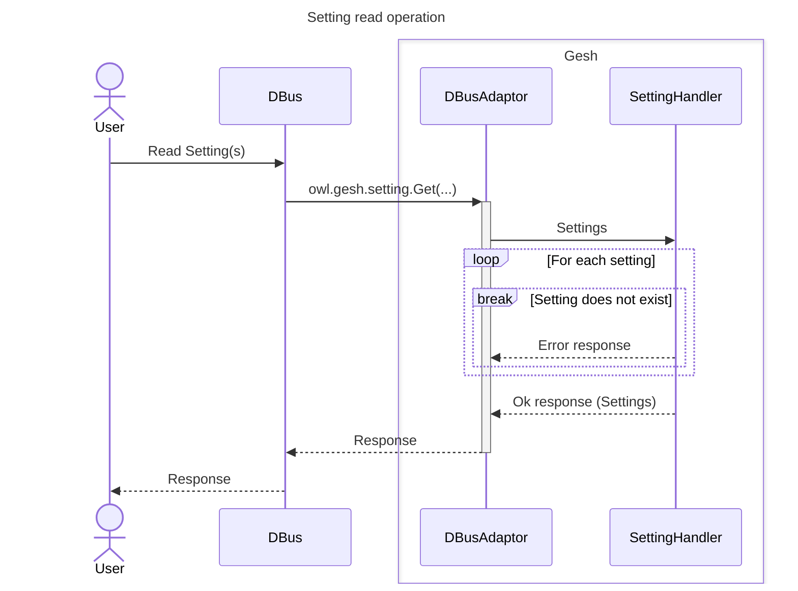
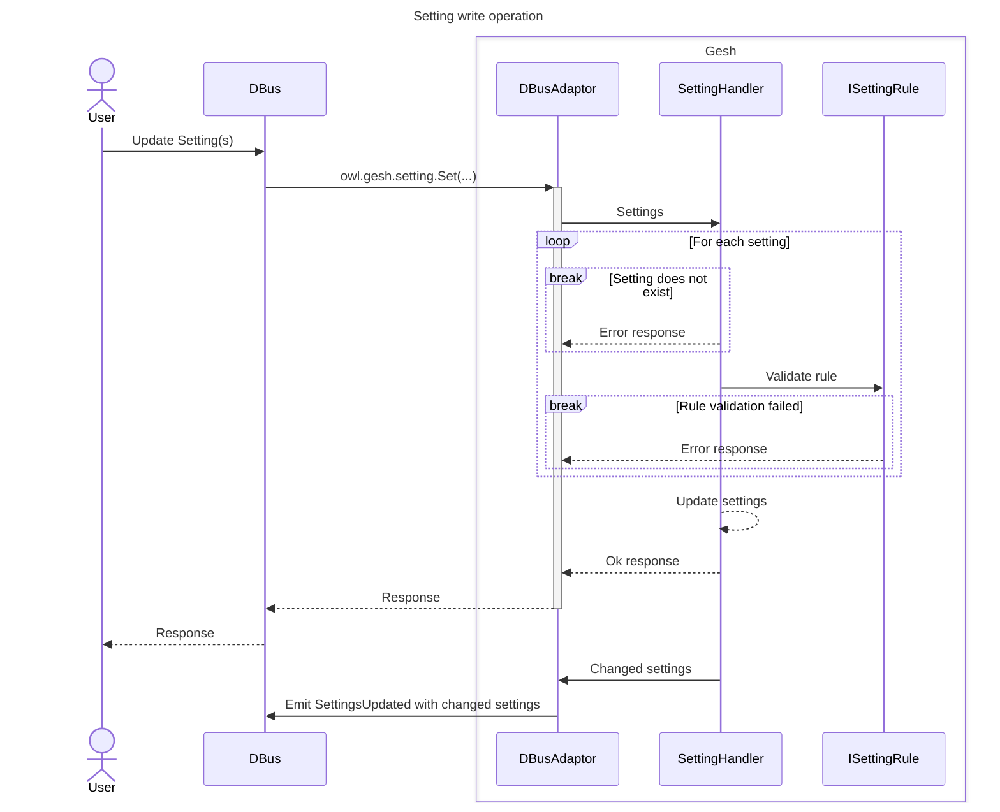

# GESH - Good Enough Settings Handler

Simple D-Bus settings handler

# Setting handling

All actors that contibute to the setting handling are described in greater
detail in [settings.md](src/setting/setting.md). The upcoming sections detail
an overview of the more common scenarios when interacting with Gesh.

## Reading a setting

## Changing a setting

# D-Bus handling

The D-Bus handling is described in greater detail in
[dbus.md](src/dbus/dbus.md). D-Bus was chosen for the external interface since
it is commonly used in linux environments, but the design should allow any
interface to be used in its stead.
