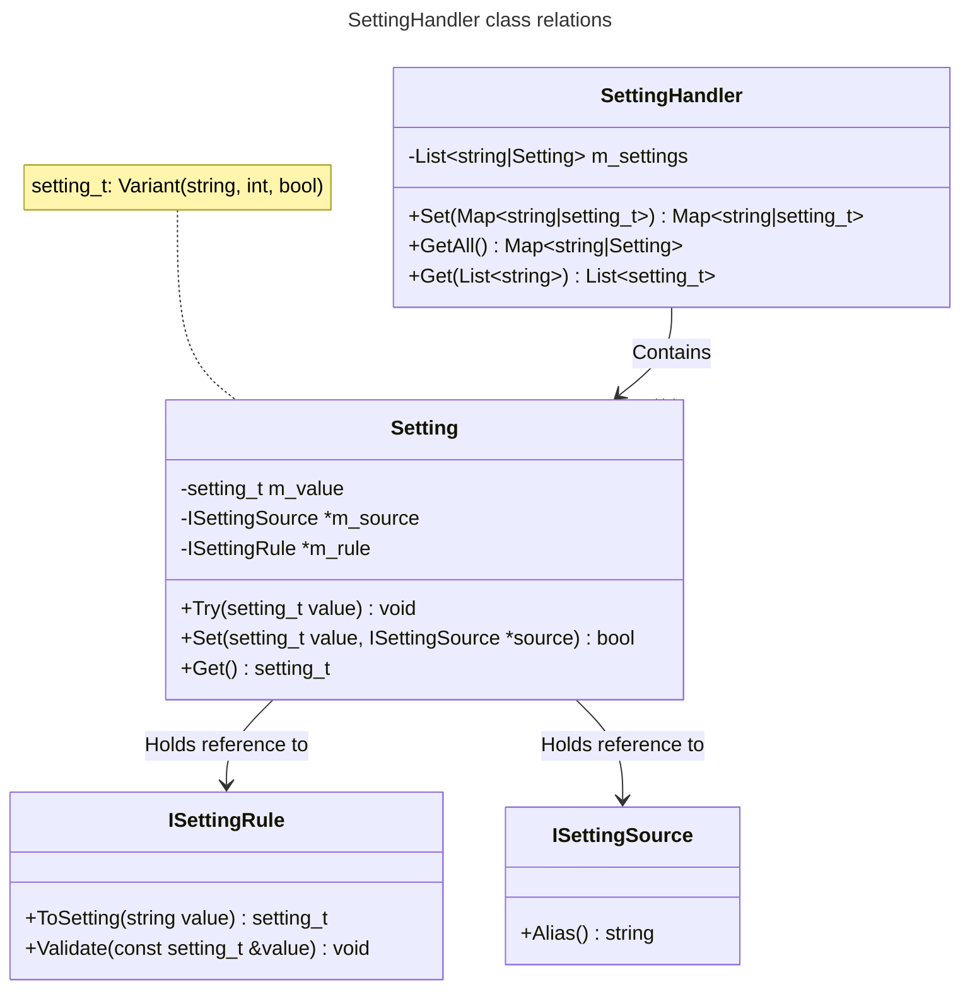

# Settings

The `SettingHandler` is the central point for interacting with settings, the
diagram below details the relations between the `SettingHandler` and any other
setting-related classes.

# SettingHandler
The `SettingHandler` class is the main point of interaction for settings. It
handles setting access, updating, rule verification and much more.

## Writing changed settings to persistent storage
> [!WARNING]
> How writing is to be handled is still not decided, a few possible solutions
  are presented below.

### Write the updated setting to its original source
At first glance, this makes a lot of sense. Writing back to the source should
be a good thing, right? The problem with this idea it that GESH is intended to
operate on a base configuration complemented by a number of setting fragments,
each intended to fulfill a specific purpose.

It the fragments are changed, there will be no way to revert the change since
the original fragment has been altered.

### Require the user to provide the fragment path
If we don't want the user to unintentionally alter fragments, we can force them
to say what fragment they want to update by requiring a fragment path. This
creates a few new problems. The most apparent is that we now require the user
to know that fragments exist, something that GESH was designed to keep out of
sight... The idea is decent though, and guides us in the direction of the next
option.

### Save changes settings to a user file
If we don't want the end-user to mess around with fragment paths, we might as
well put all of their 'day-to-day' changes in a single fragment file, and
always use the same one. This does away with a lot of the complexity,
simplifying the user experience a bit. For power-users, we can provide an API
through which they can upload fragments to custom paths.

# Initializers and Readers
Initializers and readers share a lot of similarities in that they both
configure settings. The main differences are outlined in the sections below. 

## Initializers
The [SettingHandler](#settinghandler) only accept a single initializer. The
Initializer (any class derived from `ISettingInitializer`) tells the handler
what settings exist, and which [rules](#rule-handling) they must obey.

> [!NOTE]
> After the settings have been initialized, settings **can not** be added or
  removed, and rules **can not** be altered.  This is per design, and ensures
  that rules can never be invalidated, added or removed once they have been
  set up.

Settings that fail rule validation during initialization are ignored, although
this should be rare and is considered programmer error.

## Readers
Any number of setting readers (classes derived from `ISettingReader`) can be
added when initializing the [SettingHandler](#settinghandler). Reader handle
the bulk of setting sourcing. The setting readers are iterated over in the
order they are provided, effectively making later reader _higher priority_.

When read, settings are validated towards the rules set up by the [Setting
initializer](#initializers). If validation fails, the setting is ignored.

## Reader factory
The reader factory will find any setting fragments on the paths provided to it
and return a vector of readers for the files.

# Rule handling
All settings are required to have a rule. I a setting does not need to follow
any specific constraints, make it use a SettingRuleString since that is the
most lenient rule.
